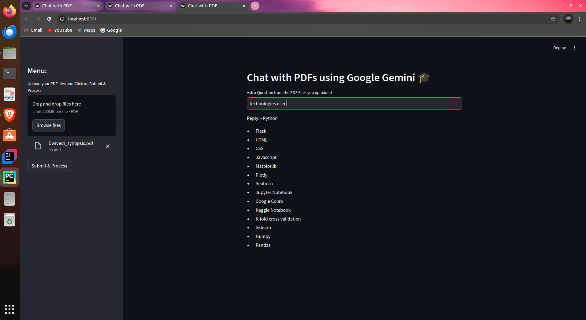

# Chat With Multiple PDFs

This project, **"Chat With Multiple PDFs"**, is an interactive AI-powered application that allows users to communicate with multiple PDFs simultaneously using **Generative AI** techniques. By integrating **Langchain**, the system efficiently extracts data from PDFs, streamlining manual data entry processes and enhancing user productivity.

## Features

- **Multiple PDF Interaction**: Simultaneous querying and data extraction from multiple PDF documents.
- **Generative AI Integration**: Utilizes advanced AI models to interpret and generate relevant responses based on the PDF content.
- **Langchain Integration**: Efficient data extraction using Langchain’s capabilities to structure and retrieve information.
- **User-Friendly Interface**: Built using **Streamlit** for a simple, intuitive UI.
- **Automated Data Entry Reduction**: Helps minimize manual effort by quickly fetching the required data from PDFs.
- **Gemini Pro and Generative AI**: Enhances interaction with PDFs using the power of Gemini Pro for more advanced language understanding.

## Tech Stack

- **Python**: Core programming language for logic and functionality.
- **Langchain**: Library for efficient and scalable data extraction from documents.
- **Gemini Pro**: Leverages advanced AI models for better comprehension of PDF content.
- **Generative AI**: To generate and interpret responses based on the input data.
- **Streamlit**: Used for building a user-friendly interface to interact with PDFs.
- **PyCharm**: Development environment.

## Installation

To run this project locally, follow the steps below:

1. Clone the repository:

    ```bash
    git clone https://https://github.com/Healthy-Manish/Generative-AI-PDF-chat-app.git/
    ```

2. Navigate to the project directory:

    ```bash
    cd Generative-AI-PDF-chat-app
    cd main
    ```

3. Create and activate a virtual environment:

    ```bash
    python3 -m venv venv
    source venv/bin/activate  # On Windows: venv\Scripts\activate
    ```

4. Install dependencies:

    ```bash
    pip install -r requirements.txt
    ```

5. Run the Streamlit app:

    ```bash
    streamlit run app.py
    ```


## Usage

1. Upload multiple PDFs via the interface.
2. The application will process the PDFs and allow you to query across all documents.
3. Responses will be generated using AI and will include relevant information from the uploaded PDFs.
4. Use the intuitive interface to browse, extract, and analyze data from the documents.

## Folder Structure

```plaintext
.
├── app.py              # Main Streamlit application file
├── requirements.txt    # Python dependencies
├── README.md           # Project documentation
└── data/               # Directory to store PDF files
```
<h2>This is the UI of the project of this chat app, I have created with the help of Gemini Pro</h2>
</img>
